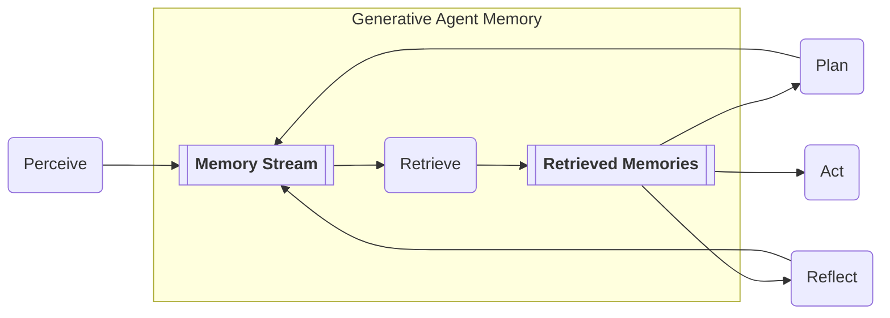

# Generative Agents:<br/>Interactive Simulacra<br/>of Human Behavior

<https://arxiv.org/abs/2304.03442>

We're building a Python implementation of Generative Agents.

Join us on Discord: <https://discord.gg/5dkM59gsDY>

## TODO and contributing

Check out the issues and projects tabs, there are also `# TODO`s scatered around the code.

## Usage

```sh
pip install openai
```

### Authentication

Create a `openai_api.py` file and set your key there.

> **Note** https://platform.openai.com/docs/api-reference/authentication

```py
import openai

openai.api_key = 'OpenAI API key'
```

<!-- Tip: Use https://github.com/PawanOsman/ChatGPT -->

## Helpful links

- <https://reverie.herokuapp.com/arXiv_Demo/#>
- <https://platform.openai.com/docs/guides/chat/introduction>
- <https://platform.openai.com/docs/api-reference/chat>
